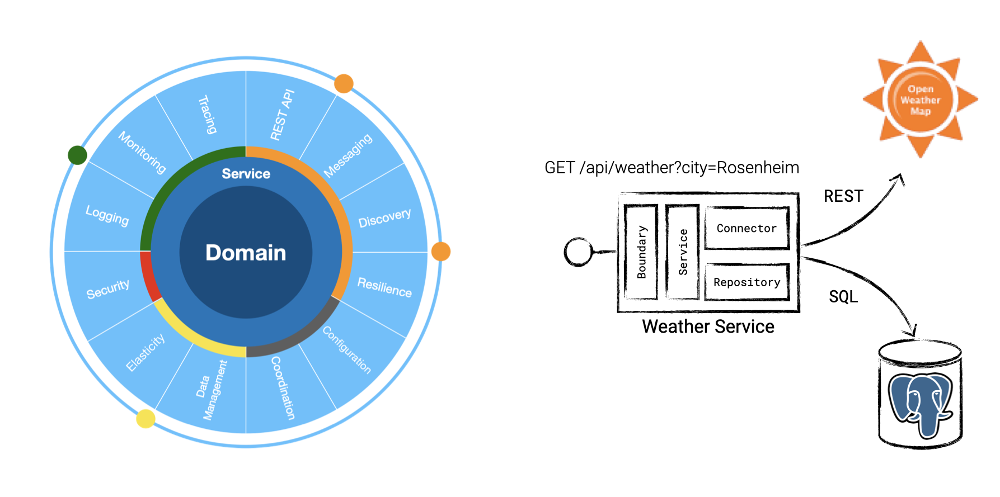

# Cloud-native Experience Lab (for Software Engineers)

This experience lab puts its focus on cloud-native software engineers. No matter which implementation language is used, the conceptual items are very similar.

Currently, several implementations of the lab and the Weather Service are available:
- JavaEE 8: https://github.com/qaware/cloud-native-weather-javaee
- Spring Framework: https://github.com/qaware/cloud-native-weather-spring
- Golang: https://github.com/qaware/cloud-native-weather-golang
- .NET Core: https://github.com/qaware/cloud-native-weather-dotnet

## Cloud-native Development

### 12-factor App Principles

There are several principles a good cloud-native application must and should adhere to.

_TODO:_ Implement some of the 12-factor app principles within the given application. Think about external configuration via ENV variables. Use a circuit breaker for the REST call to the external weather API. Provide useful technical and business metrics. Use structured logging.

### Containerization

In this stage, the microservice and all required resources need to be containerized, so that the runtime environment is the same overall stages of the software.

_TODO:_ Implement a Dockerfile to build and containerize the given application.

### Deployment (using Kustomize)

In this stage, we will have a look at how to implement redundancy-free K8s deployment manifests using Kustomize. 

_TODO:_ Implement a Kustomize base manifest as well as a Dev and Prod overlay manifest for the given microservice application.

### Deployment (using Helm)
_TODO:_

## Local Developer Experience

For efficient development of modern microservices a local-first strategy should be adopted. This sections shows how to develop effiently and locally.

### Skaffold

_TODO:_ Implement the required Skaffold manifest to continously build and deploy the artifact to the local development environment.

### Tilt

_TODO:_ Implement the required Tilt manifest to continously build and deploy the artifact to the local development environment.

## Continuous Integration

The software under development must be built on every (significat) change to ensure that no regressions have been introduced by that latest changes.

### GitHub Actions

_TODO:_ Implement GitHub Actions to build and publish the final Docker artifacts for deployment.

## Continous Delivery

### Flux2 CD

_TODO:_ Implement the required Flux configurations for your application repository to have your application deployed securely to a known environment.
